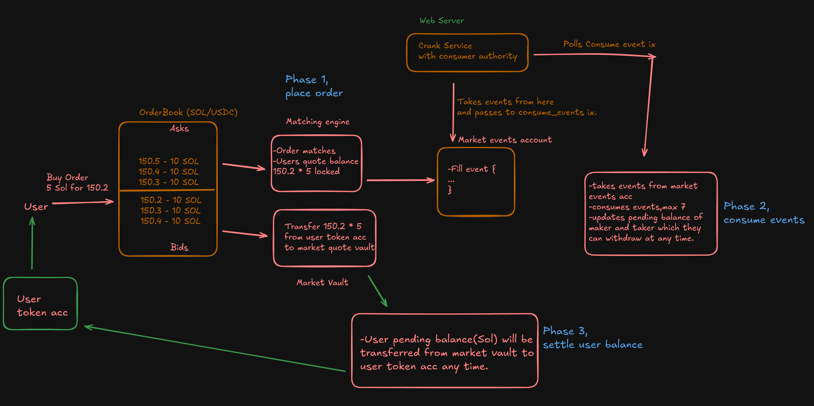

# On-Chain Orderbook - Solana Native Implementation

A production-ready, native Rust Solana orderbook implementing deferred settlement architecture with **zero-copy data structures** and comprehensive security features.

## 🎯 Overview

This orderbook implements a **deferred settlement architecture** similar to production DEXs like Serum/OpenBook, providing:

- **Real token custody** during order placement
- **Virtual settlement** through authority-controlled event processing
- **User-controlled withdrawal** of settled tokens
- **Production-grade security** with comprehensive mint checks
- **Zero-copy architecture** using `bytemuck` for maximum performance
- **Memory-efficient** large data structures with `#[repr(C)]`

## 🏗️ Architecture



The orderbook follows a **3-phase deferred settlement model** with **zero-copy data access**:

### Phase 1: place_order (Token Custody)

- Users transfer real SPL tokens to market vaults
- Orders are matched using price-time priority
- Fill events are logged for later settlement
- Remaining orders are added to the orderbook

### Phase 2: consume_events (Virtual Settlement)

- Authority-controlled batch processing (max 7 events)
- Updates both maker and taker balances per fill event
- Transfers: `locked_balance` → `pending_balance`
- Efficient event array compaction

### Phase 3: settle_balance (Token Withdrawal)

- User-initiated real token withdrawals
- Market authority PDA-signed transfers
- Transfers: Market vaults → User token accounts
- Resets `pending_balance` to zero

## Key Features

### 🔒 **Security First**

- **Mint Verification**: Prevents wrong token deposits/withdrawals
- **Vault Validation**: Ensures correct market vault usage
- **PDA Verification**: Authority-based access control
- **Account Validation**: Comprehensive ownership checks

### ⚡ **Performance Optimized**

- **Zero-Copy Architecture**: Direct memory access using `bytemuck`
- **Memory Layout Control**: `#[repr(C, packed)]` for optimal data structures
- **Batch Processing**: Handle multiple events efficiently
- **Gas Efficiency**: Authority pays for settlement
- **Memory Management**: Efficient event array compaction
- **Capital Efficiency**: Perfect for high-frequency trading

### 🛠️ **Production Ready**

- **Modular Design**: Clean separation of concerns
- **Error Handling**: Detailed error messages for debugging
- **Flexible Deposits**: Separate base/quote token deposits
- **Account Management**: Automatic PDA account creation
- **Order Cancellation**: Full cancel order functionality
- **Comprehensive Testing**: 8 test suites with 78+ assertions

## 🔄 3-Phase Settlement Flow

```
User Places Order → Real Token Transfer → Event Logging
        ↓
Authority Processes Events → Virtual Balance Updates → Event Cleanup
        ↓
User Settles Balance → Real Token Withdrawal → Balance Reset
```

### Benefits of Deferred Settlement:

- **Gas Efficiency**: Authority batch processes events
- **User Control**: Withdraw tokens when convenient
- **Scalability**: Handle multiple trades efficiently
- **Capital Efficiency**: Optimal for high-frequency scenarios

## 🚀 Zero-Copy Architecture

### Memory-Efficient Data Structures

```rust
#[repr(C, packed)]
#[derive(Debug, Clone, Copy, Zeroable, Pod)]
pub struct Order {
    pub owner: Pubkey,
    pub market: Pubkey,
    pub timestamp: i64,
    pub order_id: u64,
    pub price: u64,
    pub quantity: u64,
    pub filled_quantity: u64,
    pub side: Side,
}

#[repr(C, packed)]
#[derive(Debug, Clone, Copy, Zeroable, Pod)]
pub struct OrderBook {
    pub orders: [Order; MAX_ORDERS],    // 1024 orders
    pub market: Pubkey,
    pub active_orders_count: u64,
    pub side: Side,
}
```

### Direct Memory Access

```rust
// Zero-copy access to large data structures
let mut bids_data = bids_info.data.borrow_mut();
let bids: &mut OrderBook = bytemuck::from_bytes_mut(&mut bids_data);

let mut events_data = market_events_info.data.borrow_mut();
let events: &mut MarketEvents = bytemuck::from_bytes_mut(&mut events_data);
```

### Account Sizes

- **OrderBook**: 107,561 bytes (~105KB) - Supports 1,024 orders
- **MarketEvents**: 50,232 bytes (~49KB) - Supports 512 events
- **Order**: 105 bytes per order
- **Event**: 98 bytes per event

### Security Features

#### Mint Verification

```rust
// Verifies user token accounts contain correct mints
user_token_mint == market_state.expected_mint
```

#### Vault Validation

```rust
// Ensures operations use correct market vaults
vault_account.key == market_state.vault_key
```

#### Authority Control

```rust
// Only authorized crank can process events
signer == market_state.consume_events_authority
```

## 📝 Instructions

### Core Instructions

| Instruction          | Description                                      | Authority Required |
| -------------------- | ------------------------------------------------ | ------------------ |
| `InitializeMarket`   | Create new trading market                        | Market Creator     |
| `DepositQuoteTokens` | Deposit quote tokens (creates account if needed) | User               |
| `DepositBaseTokens`  | Deposit base tokens                              | User               |
| `PlaceOrder`         | Place buy/sell order                             | User               |
| `CancelOrder`        | Cancel existing order                            | Order Owner        |
| `ConsumeEvents`      | Process settlement events                        | Crank Authority    |
| `SettleBalance`      | Withdraw settled tokens                          | User               |

### Order Cancellation

```rust
// Cancel order generates EventType::Out event
let cancel_event = Event {
    event_type: EventType::Out,
    maker: user_key,
    taker: Pubkey::default(),
    maker_order_id: order_id,
    quantity: remaining_quantity,
    price: order_price,
    timestamp: clock.unix_timestamp,
    side: order_side,
};
```

### Example Usage - Check Client directory for comprehensive examples

## 🏛️ Account Structure

### MarketState (364 bytes)

```rust
pub struct MarketState {
    pub authority: Pubkey,                    // Market creator
    pub consume_events_authority: Pubkey,     // Crank authority
    pub base_mint: Pubkey,                    // Base token mint
    pub quote_mint: Pubkey,                   // Quote token mint
    pub base_vault: Pubkey,                   // Base token vault
    pub quote_vault: Pubkey,                  // Quote token vault
    pub market_events: Pubkey,                // Events account
    pub bids: Pubkey,                         // Bids orderbook
    pub asks: Pubkey,                         // Asks orderbook
    pub min_order_size: u64,                  // Minimum order size
    pub tick_size: u64,                       // Price tick size
    pub next_order_id: u64,                   // Order ID counter
    pub last_price: u64,                      // Last trade price
    pub volume_24h: u64,                      // 24h volume
    pub fee_rate_bps: u16,                    // Fee rate (basis points)
    pub bump: u8,                             // PDA bump
    pub is_initialized: bool,                 // Initialization flag
}
```

### UserBalance (112 bytes)

```rust
pub struct UserBalance {
    pub owner: Pubkey,                 // User public key
    pub market: Pubkey,                // Market public key
    pub available_base_balance: u64,   // Available for new orders
    pub available_quote_balance: u64,  // Available for new orders
    pub locked_base_balance: u64,      // Locked in sell orders
    pub locked_quote_balance: u64,     // Locked in buy orders
    pub pending_base_balance: u64,     // Earned tokens (virtual)
    pub pending_quote_balance: u64,    // Earned tokens (virtual)
}
```

### Event Types

```rust
#[repr(u8)]
#[derive(Debug, Clone, Copy, PartialEq)]
pub enum EventType {
    Fill = 0,  // Order fill event
    Out = 1,   // Order cancellation event
}

#[repr(u8)]
#[derive(Debug, Clone, Copy, PartialEq)]
pub enum Side {
    Buy = 1,   // Buy order
    Sell = 2,  // Sell order
}
```

### PDA Seeds

```rust
Market: ["market", base_mint, quote_mint]
UserBalance: ["user_balance", user_key, market_key]
Vaults: ["base_vault", market_key] / ["quote_vault", market_key]
FeeAccount: ["fee_account", market_key]
```

## 🧪 Comprehensive Testing

The project includes 8 comprehensive test suites with 78+ assertions:

1. **Initialize Market** - Market creation and setup
2. **User Balance Management** - Deposit quote and base tokens
3. **Order Placement & Matching** - Buy/sell orders with event consumption
4. **Complex Multi-User Trading** - Deep orderbook, market sweeps, partial fills
5. **Balance Settlement** - Complex settlement scenarios and edge cases
6. **Extreme Order Scenarios** - Micro-orders, large volumes, price extremes
7. **Comprehensive Stress Test** - Deep orderbook with batch event processing
8. **Error Handling** - Graceful handling of insufficient funds and edge cases

### Test Coverage

- ✅ Order placement and matching logic
- ✅ Event generation and consumption
- ✅ Balance settlement mechanisms
- ✅ Multi-user trading scenarios
- ✅ Market sweep operations
- ✅ Partial fill handling
- ✅ Error conditions and edge cases
- ✅ Memory safety and data integrity

## 🚀 Getting Started

### Prerequisites

- Rust 1.70+
- Solana CLI 1.16+
- Bun (for testing)

### Build & Test

```bash
# Clone repository
git clone <repository-url>
cd Onchain-Orderbook

# Build program
cd program
cargo build-sbf

# Run comprehensive tests
cd ../client
bun test
```

### Deploy

```bash
# Deploy to devnet
solana program deploy target/deploy/orderbook.so --url devnet

# Or deploy to localnet for testing
solana-test-validator
solana program deploy target/deploy/orderbook.so --url localhost
```

## 📁 Project Structure

```
Onchain-Orderbook/
├── program/
│   ├── src/
│   │   ├── lib.rs                    # Program entry point
│   │   ├── state.rs                  # Zero-copy state definitions
│   │   └── instructions/
│   │       ├── mod.rs                # Instruction exports
│   │       ├── initialize_market.rs  # Market creation
│   │       ├── create_user_account.rs # Token deposits
│   │       ├── place_order.rs        # Order placement & matching
│   │       ├── cancel_order.rs       # Order cancellation
│   │       ├── consume_events.rs     # Event processing
│   │       └── settle_balance.rs     # Token withdrawal
│   └── Cargo.toml
├── client/
│   ├── src/
│   │   ├── orderbook.test.ts         # Comprehensive test suite
│   │   └── states.ts                 # TypeScript state schemas
│   └── package.json
└── README.md
```

## 🔮 Recent Enhancements

- ✅ **Order Cancellation**: Full cancel order functionality with EventType::Out
- ✅ **Zero-Copy Architecture**: Memory-efficient data structures using bytemuck
- ✅ **Comprehensive Testing**: 8 test suites covering all functionality
- ✅ **Error Handling**: Graceful handling of edge cases and insufficient funds
- ✅ **Memory Safety**: Proper order removal without unsafe operations
- ✅ **Event Processing**: Robust event consumption with batch processing

## 🔮 Future Enhancements

- [ ] Advanced order types (stop-loss, take-profit)
- [ ] Fee collection mechanism
- [ ] Referral program integration
- [ ] Cross-program invocation support
- [ ] Governance token integration
- [ ] Order book compression for even larger capacity

## 🤝 Contributing

Please feel free to submit a Pull Request if you find any mistakes in my implementation.

**Built with ❤️ on Solana **
